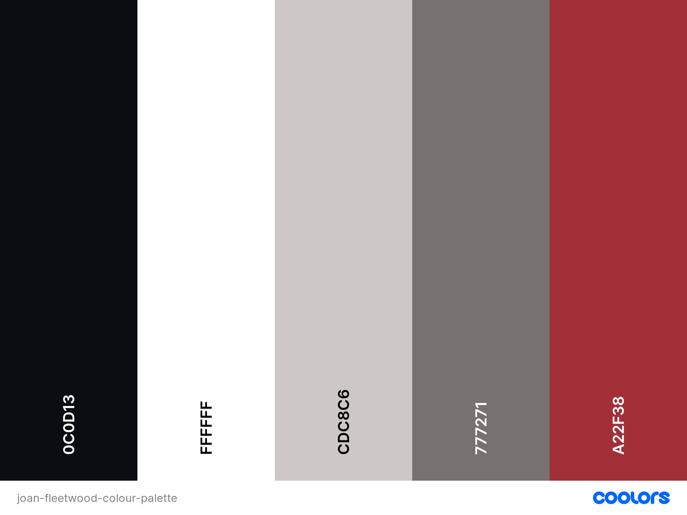

# Joan Fleetwood

## Intro

Joan Fleetwood | Actor & Model is a portfolio site to showcase Joan Fleetwood's work as an actor.  The site will be targeted towards casting directors and other industry professionals who are looking for a female actor aged 60+.  It will give Joan a website that she can use to market herself on the web and make it easy for people to find Joan, to see the work that she has done and to contact her, all in one place. 

View [Joan Fleetwood | Actor & Model](https://ejfleet.github.io/joan-fleetwood-actor/) on Github Pages.

---

## CONTENTS

* [User Experience](#user-experience-ux)
  * [User Stories](#user-stories)

* [Design](#design)
  * [Colour Scheme](#colour-scheme)
  * [Typography](#typography)
  * [Imagery](#imagery)
 
* [Features](#features)
  * [General Features on Each Page](#general-features-on-each-page)
  * [Future Implementations](#future-implementations)
  * [Accessibility](#accessibility)

* [Technologies Used](#technologies-used)
  * [Languages Used](#languages-used)
  * [Frameworks, Libraries & Programs Used](#frameworks-libraries--programs-used)

* [Deployment & Local Development](#deployment--local-development)
  * [Deployment](#deployment)
  * [Local Development](#local-development)
    * [How to Fork](#how-to-fork)
    * [How to Clone](#how-to-clone)

* [Testing](#testing)

* [Credits](#credits)
  * [Code Used](#code-used)
  * [Content](#content)
  * [Media](#media)
  * [Acknowledgments](#acknowledgments)

---

## User Experience (UX)

### Initial Discussion

Joan embarked on an acting career in 2010 and needed a website to showcase her work since then.  It is easier for actors to get work if they have a link to a portfolio site that they can send out to agents, directors, casting directors and producers.  She wanted a website that was clean and easy to navigate.  She showed me an example of a website that she liked so that I could get a feel for what might work.  The website is [here](https://www.wix.com/website-template/view/html/1668?originUrl=https%3A%2F%2Fwww.wix.com%2Fwebsite%2Ftemplates%2Fhtml%2Fcreative-arts%2Fperforming-arts&tpClick=view_button&esi=d9b503b0-7ed5-4760-93ff-265a7277fb6d).

#### Key Information for the Site

* Joan's appearance and experience
* Her showreel, which is a collation of acting work that she has done
* Her resumé
* A gallery of photos
* How to contact Joan
* How to contact her agent

### User Stories

#### Client Goals

* To be able to view the site on a range of device sizes
* To find out if Joan's appearance is suitable for a particular acting role
* To find out if Joan is experienced enough to manage a particular acting role
* To see examples of Joan's work
* To contact Joan or her agent with audition or job offers

#### First-time Visitor Goals

I want to: 
* know what Joan looks like
* know what acting/modelling experience Joan has
* know if Joan is suitable for a particular role
* see Joan's showreel
* be able to navigate the site easily to find information
* find links to Joan's social media channels
* contact Joan or her agent

#### Returning Visitor Goals

I want to: 
* see what work Joan has done recently
* contact Joan or her agent about a potential role

#### Frequent Visitor Goals

I want to 
* get in touch with Joan
* see if Joan has uploaded the work we produced together

## Design

### Colour Scheme

Joan and I wanted to use minimal colour in the website in order not to make it too 'loud', as there would be plenty of colour from the photos used.  I decided on a pink colour for the h1-4 headings to make them stand out.  I chose that colour by uploading a photo to [Color Space](https://mycolor.space/) and adjusting the shade of pink to get the right colour - it matches Joan's lipstick in the first image which adds to the visual cohesion of the site.

The colour palette was created using the [Coolors](https://coolors.co/) website.

### Typography

Google Fonts was used to import the chosen fonts for use in the site.

I chose two sans-serif fonts - Montserrat for headings and Inter for body text - as they give a clean look, are easy to read and look good together.  

Both fonts are downloaded as variable fonts, with weights ranging from 100-900.  

### Imagery

The imagery for the site consists of photographs of Joan in various outfits and poses, showcasinging her range of experience in acting and modelling.

The image used for the background of the contact form was downloaded from [iStock](https://www.istockphoto.com/).

### Features

The website consists of one continuous page, divided up into sections.  There is a fixed header and navigation menu at the top of the page, and a footer at the bottom.

The site was designed mobile-first and is responsive at every screen size.

The sections are divided into:
* About 
* Resumé
* Gallery 
* Contact

#### Header

##### Mobile

##### Desktop

I used a 'hamburger' menu icon to hide the navigation menu in mobile view, to give more space.  Clicking it brings a dropdown menu of the different sections on the site.

The desktop header stretches across the whole viewport, even on very large screens, to give a framing effect to the content below.

The header is fixed, in order to keep the navigation menu in view the whole time, as it is a one-page website and scrolling back to the beginning would be tiresome for the user.

#### Footer

##### Mobile

##### Desktop

The footer contains links to Joan's social media, using icons from [FontAwesome](https://fontawesome.com/).  There are also contact details for her acting agency and a line that credits me as the designer and links to my GitHub.

As with the header, the footer stretches across the whole screen to give a framing effect.

#### Favicon

The favicon for the site was created using [favicon.io](https://favicon.io/favicon-generator/) and uses the pink and black colours from the site's colour scheme.

#### About

The About section is divided into two divs, which appear side-by-side on tablet-size screens (768px and larger).

##### Main Image

This photo of Joana was chosen as it is striking yet simple with no background clutter.

##### About Me section

This is divided into two divs which always appear on top of each other.  The About Me paragraph is a short summary of Joan's appearance and experience.  Underneath is her Showreel, which gives an audiovisual display of her work.

#### Resumé

The Resumé section details Joan's extensive experience.  It is displayed as one column on screens smaller than 576px and as three columns on larger screens.

#### Gallery

The Gallery contains snapshots of Joan in various acting and modelling roles.  It will display as 1-4 columns depending on the screen size.

#### Contact Form

##### Mobile

##### Desktop

The Contact Form has an icon of a clapperboard and a background of studio lights to emphasise the connection between Joan and the acting world.

### General features on each page

If there is a feature that appears on all pages of your site, include it here. Examples of what to include would the the navigation, a footer and a favicon.

I then like to add a screenshot of each page of the site here, i use [amiresponsive](https://ui.dev/amiresponsive) which allows me to grab an image of the site as it would be displayed on mobile, tablet and desktop, this helps to show the responsiveness of the site.

### Future Implementations

What features would you like to implement in the future on your site? Would you like to add more pages, or create login functionality? Add these plans here.

### Accessibility

Be an amazing developer and get used to thinking about accessibility in all of your projects!

This is the place to make a note of anything you have done with accessibility in mind. Some examples include:

Have you used icons and added aria-labels to enable screen readers to understand these?
Have you ensured your site meets the minimum contrast requirements?
Have you chosen fonts that are dyslexia/accessible friendly?

Code Institute have an amazing channel for all things accessibility (a11y-accessibility) I would highly recommend joining this channel as it contains a wealth of information about accessibility and what we can do as developers to be more inclusive.

## Technologies Used

👩🏻‍💻 View an example of a completed Technologies Used section [here](https://github.com/kera-cudmore/Bully-Book-Club#Technologies-Used)

### Languages Used

Make a note here of all the languages used in creating your project. For the first project this will most likely just be HTML & CSS.

### Frameworks, Libraries & Programs Used

Add any frameworks, libraries or programs used while creating your project.

Make sure to include things like git, GitHub, the program used to make your wireframes, any programs used to compress your images, did you use a CSS framework like Bootstrap? If so add it here (add the version used).

A great tip for this section is to include them as you use them, that way you won't forget what you ended up using when you get to the end of your project.

## Deployment & Local Development

👩🏻‍💻 View an example of a completed Deployment & Local Development section [here](https://github.com/kera-cudmore/TheQuizArms#Deployment)

### Deployment

Include instructions here on how to deploy your project. For your first project you will most likely be using GitHub Pages.

### Local Development

The local development section gives instructions on how someone else could make a copy of your project to play with on their local machine. This section will get more complex in the later projects, and can be a great reference to yourself if you forget how to do this.

#### How to Fork

Place instructions on how to fork your project here.

#### How to Clone

Place instructions on how to clone your project here.

## Testing

Start as you mean to go on - and get used to writing a TESTING.md file from the very first project!

Testing requirements aren't massive for your first project, however if you start using a TESTING.md file from your first project you will thank yourself later when completing your later projects, which will contain much more information.
  
Use this part of the README to link to your TESTING.md file - you can view the example TESTING.md file [here](milestone1-testing.md)

## Credits

👩🏻‍💻 View an example of a completed Credits section [here](https://github.com/kera-cudmore/BookWorm#Credits)

The Credits section is where you can credit all the people and sources you used throughout your project.

### Code Used

If you have used some code in your project that you didn't write, this is the place to make note of it. Credit the author of the code and if possible a link to where you found the code. You could also add in a brief description of what the code does, or what you are using it for here.

### Content

Who wrote the content for the website? Was it yourself - or have you made the site for someone and they specified what the site was to say? This is the best place to put this information.

###  Media

If you have used any media on your site (images, audio, video etc) you can credit them here. I like to link back to the source where I found the media, and include where on the site the image is used.
  
###  Acknowledgments

If someone helped you out during your project, you can acknowledge them here! For example someone may have taken the time to help you on slack with a problem. Pop a little thank you here with a note of what they helped you with (I like to try and link back to their GitHub or Linked In account too). This is also a great place to thank your mentor and tutor support if you used them.