# Joan Fleetwood

## Intro

Joan Fleetwood | Actor | Model is a portfolio site to showcase Joan Fleetwood's work as an actor.  The site will be targeted towards casting directors and other industry professionals who are looking for a female actor aged 60+.  It will give Joan a website that she can use to market herself on the web and make it easy for people to find Joan, to see the work that she has done and to contact her, all in one place. 

View [Joan Fleetwood | Actor | Model](https://ejfleet.github.io/joan-fleetwood-actor/) on Github Pages.

---

## CONTENTS

* [User Experience](#user-experience-ux)
  * [Initial Discussion](#initial-discussion)
  * [User Stories](#user-stories)

* [Design](#design)
  * [Colour Scheme](#colour-scheme)
  * [Typography](#typography)
  * [Imagery](#imagery)
  * [Wireframes](#wireframes)
 
* [Features](#features)
  * [Header](#header)
  * [Footer](#footer)
  * [Favicon](#favicon)
  * [About](#about)
  * [Resumé](#resume)
  * [Gallery](#gallery)
  * [Contact Form](#contact-form)
  * [Future Implementations](#future-implementations)
  * [Accessibility](#accessibility)

* [Technologies Used](#technologies-used)
  * [Languages Used](#languages-used)
  * [Frameworks, Libraries & Programs Used](#frameworks-libraries--programs-used)

* [Deployment & Local Development](#deployment--local-development)
  * [Deployment](#deployment)
  * [Local Development](#local-development)
    * [How to Fork](#how-to-fork)
    * [How to Clone](#how-to-clone)

* [Testing](#testing)
  * [Functionality](#functionality)
  * [Browser Compatibility](#browser-compatibility)
  * [Responsiveness](#responsiveness)
  * [HTML and CSS Validation](#html-and-css-validation)
  * [Solved Bugs](#solved-bugs)

* [Credits](#credits)
  * [Code Used](#code-used)
  * [Content](#content)
  * [Media](#media)
  * [Acknowledgments](#acknowledgments)

---

## User Experience (UX)

### Initial Discussion

Joan embarked on an acting career in 2010 and needed a website to showcase her work since then.  It is easier for actors to get work if they have a link to a portfolio site that they can send out to agents, directors, casting directors and producers.  She wanted a website that was clean and easy to navigate.  She showed me an example of a website that she liked so that I could get a feel for what might work.  The website is [here](https://www.wix.com/website-template/view/html/1668?originUrl=https%3A%2F%2Fwww.wix.com%2Fwebsite%2Ftemplates%2Fhtml%2Fcreative-arts%2Fperforming-arts&tpClick=view_button&esi=d9b503b0-7ed5-4760-93ff-265a7277fb6d).

#### Key Information for the Site

* Joan's appearance and experience
* Her showreel, which is a collation of acting work that she has done
* Her resumé
* A gallery of photos
* How to contact Joan

### User Stories

#### Client Goals

* To be able to view the site on a range of device sizes
* To find out if Joan's appearance is suitable for a particular acting role
* To find out if Joan is experienced enough to manage a particular acting role
* To see examples of Joan's work
* To contact Joan with audition or job offers

#### First-time Visitor Goals

I want to: 
* know what Joan looks like
* know what acting/modelling experience Joan has
* know if Joan is suitable for a particular role
* see Joan's showreel
* be able to navigate the site easily to find information
* find links to Joan's social media channels
* contact Joan

#### Returning Visitor Goals

I want to: 
* see what work Joan has done recently
* contact Joan about a potential role

#### Frequent Visitor Goals

I want to 
* get in touch with Joan
* see if Joan has uploaded the work we produced together

## Design

### Colour Scheme

Joan and I wanted to use minimal colour in the website in order not to make it too 'loud', as there would be plenty of colour from the photos used.  I decided on a pink colour for the h1-4 headings to make them stand out.  I chose that colour by uploading a photo to [Color Space](https://mycolor.space/) and adjusting the shade of pink to get the right colour - it matches Joan's lipstick in the first image which adds to the visual cohesion of the site.

The colour palette was created using the [Coolors](https://coolors.co/) website.

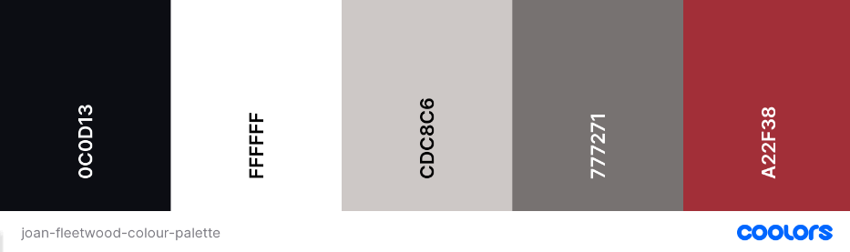

### Typography

Google Fonts was used to import the chosen fonts for use in the site.

I chose two sans-serif fonts - Montserrat for headings and Inter for body text - as they give a clean look, are easy to read and look good together.  

Both fonts are downloaded as variable fonts, with weights ranging from 100-900.  

### Imagery

The imagery for the site consists of photographs of Joan in various outfits and poses, showcasinging her range of experience in acting and modelling.

The image used for the background of the contact form was downloaded from [iStock](https://www.istockphoto.com/).

### Wireframes

The wireframes that I originally designed were for a multi-page website.  Through my research and advice from my mentor I realised that a one-page website divided into sections would be better for the user experience.  The original wireframes are below - though the concept evolved, the original layout is still relevant and can be recognised in the finished site.

#### Mobile

Home and Resumé
  

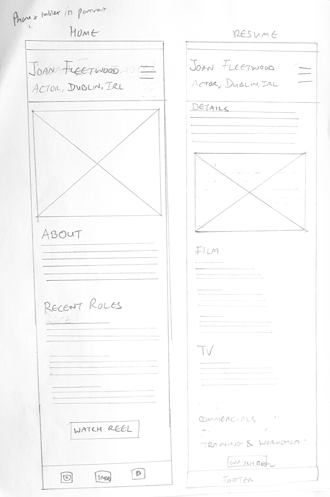

 

Reel and Gallery
  

 

Contact Form
  

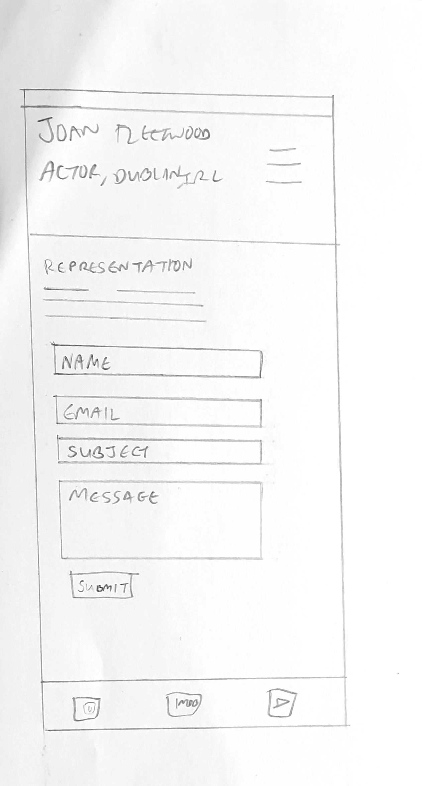

 

#### Desktop

Home and Resumé
  

 

Reel and Gallery
  

 

Contact Form
  

 

## Features

The website consists of one continuous page, divided up into sections.  There is a fixed header and navigation menu at the top of the page, and a footer at the bottom.

The site was designed mobile-first and is responsive at every screen size.

The sections are divided into:
* About 
* Resumé
* Gallery 
* Contact

### Header

#### Mobile
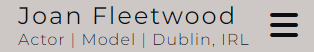

#### Desktop

I used a 'hamburger' menu icon to hide the navigation menu in mobile view, to give more space.  Clicking it brings a dropdown menu of the different sections on the site.

The desktop header stretches across the whole viewport, even on very large screens, to give a framing effect to the content below.

The header is fixed, in order to keep the navigation menu in view the whole time, as it is a one-page website and scrolling back to the beginning would be tiresome for the user.

### Footer

#### Mobile

#### Desktop

The footer contains links to Joan's social media, using icons from [FontAwesome](https://fontawesome.com/).  There are also contact details for her acting agency and a line that credits me as the designer and links to my GitHub.

As with the header, the footer stretches across the whole screen to give a framing effect.

### Favicon

The favicon for the site was created using [favicon.io](https://favicon.io/favicon-generator/) and uses the pink and black colours from the site's colour scheme.

### About

The About section is divided into two divs, which appear side-by-side on tablet-size screens (768px and larger).

#### Main Image

This photo of Joana was chosen as it is striking yet simple with no background clutter.

#### About Me section

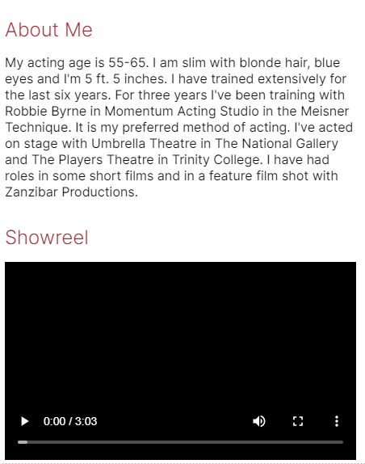

This is divided into two divs which always appear on top of each other.  The About Me paragraph is a short summary of Joan's appearance and experience.  Underneath is her Showreel, which gives an audiovisual display of her work.

### Resumé

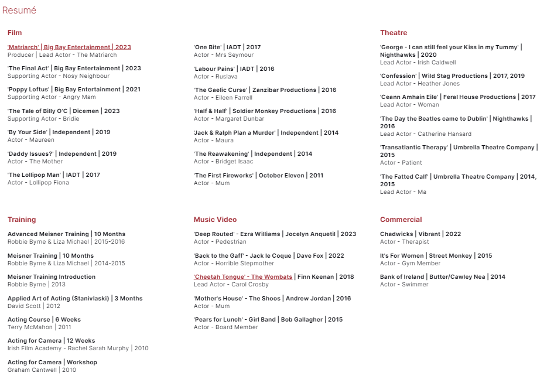

The Resumé section details Joan's extensive experience.  It is displayed as one column on screens smaller than 576px and as three columns on larger screens.

### Gallery

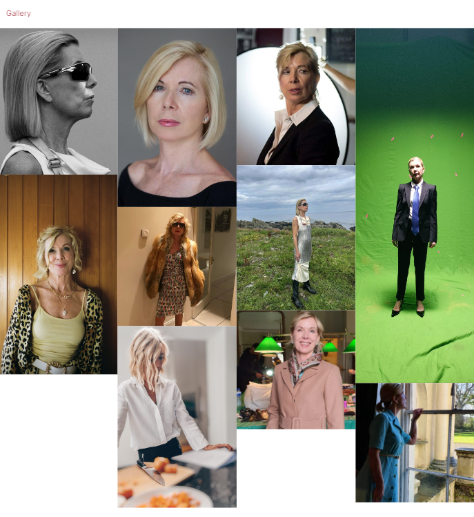

The Gallery contains snapshots of Joan in various acting and modelling roles.  It will display as 1-4 columns depending on the screen size.

### Contact Form

#### Mobile
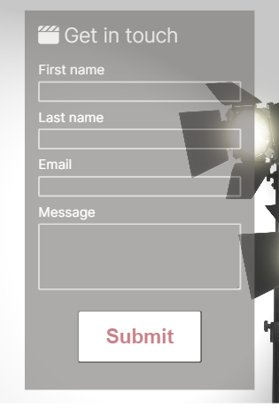

#### Desktop

The Contact Form has an icon of a clapperboard and a background of studio lights to emphasise the connection between Joan and the acting world.

### Future Implementations

I would like to add the following features:

* Section dedicated to 'Matriarch', which is a short film produced by Joan
* PHP so that the contact form is sent to Joan's email
* Add more photos to the gallery
* Possibly embed videos instead of providing links in the Resumé
* Make the About Me paragraph more detailed
* Only show the first 3 items in each Resumé section and hide the rest behind a 'Show More' button
* Possibly a 404 page - decided this was not currently important for the one-page structure of the site

### Accessibility

I have tried to make the site as accessible as possible.  Steps that I have been conscious to take are:

* Using semantic HTML
* Choosing fonts that are dyslexia-friendly
* Using descriptive alt attributes on all images 
* Providing aria-labels for screen readers where there are icons used and no text, i.e. the social media icons in the footer
* Ensuring that there is a sufficient colour contrast throughout the site

## Technologies Used

### Languages Used

HTML and CSS were the main languages used to build this site.  There is also one line of JavaScript in the head section of the HTML, which is used to display the icons from fontawesome.com.

### Frameworks, Libraries & Programs Used

Git - For version control.

Github - To save and store the files for the website.

Gitpod - For developing the site.

Google Fonts - To import the fonts used on the website.

Font Awesome - For the iconography on the website.

Google Dev Tools - To troubleshoot and test features, solve issues with responsiveness and styling.

Lighthouse - Chrome extension used to assess accessibility.

[Shields.io](https://shields.io/) for adding badges to the readme.

[Favicon.io](https://favicon.io/favicon-generator/) for creating a custom favicon.

[Achecks.org](https://www.achecks.org/apca-wcag-3-accessible-colour-contrast-checker/) for checking the colour contrast for accessibility.

[Coolors.co](https://coolors.co) for creating a colour scheme.

[Deque Univerity](https://dequeuniversity.com/rules/axe/4.8/color-contrast) for adjusting colours to meet accessibility standards.

[Beautifier.io](https://beautifier.io/) to format the site's code.

## Deployment & Local Development

### Deployment

The site is deployed using GitHub Pages - [Joan Fleetwood | Actor | Model](https://ejfleet.github.io/joan-fleetwood-actor/).

To Deploy the site using GitHub Pages:

1. Login (or signup) to Github.
2. Go to the repository for this project, [EJFleet/joan-fleetwood-actor](https://github.com/EJFleet/joan-fleetwood-actor).
3. Click the settings button.
4. Select pages in the left hand navigation menu.
5. From the source dropdown select main branch and press save.
6. The site has now been deployed, please note that this process may take a few minutes before the site goes live.

### Local Development

#### How to Fork

To fork the repository:

1. Log in or sign up to [Github](https://github.com/).
2. Go to the repository for this project, [EJFleet/joan-fleetwood-actor](https://github.com/EJFleet/joan-fleetwood-actor).
3. Click the Fork button in the top right corner.

#### How to Clone

To clone the repository:

1. Log in or sign up to [Github](https://github.com/).
2. Go to the repository for this project, [EJFleet/joan-fleetwood-actor](https://github.com/EJFleet/joan-fleetwood-actor).
3. Click on the code button, select whether you would like to clone with HTTPS, SSH or GitHub CLI and copy the link shown.
4. Open the terminal in your code editor and change the current working directory to the location you want to use for the cloned directory.
5. Type 'git clone' into the terminal and then paste the link you copied in step 3. Press enter.

## Testing

### Functionality

|Test Label|Test Action|Expected Outcome|Test Outcome|
|-----|-----|-----|-----|
|Hamburger menu|Click on hamburger icon in mobile view|Navigation menu drops down|PASS|
|Navigation links|Click on nav links in the header|Site scrolls to appropriate section|PASS|
|Showreel display|Click play button on the showreel video|Video plays in-page|PASS|
|Resumé links|Click links within Resumé|Correct link opens in a new tab|PASS|
|Contact form|Fill in form and press submit|Error messages show if text missing from any box|PASS|
|Contact form email|Enter string without @ symbol in email box|Error message to say email not correctly formatted|PASS|
|Contact form POST|Fill in form and press submit|Form submits to CI formdump with all four fields showing the information populated|PASS|
|Footer links|Click each icon in footer|Correct social media site opens in new tab|PASS|

### Browser Compatibility

The website was tested on:
* Chrome
* Edge
* Safari
* Firefox
* Chrome for Android

### Responsiveness

The site was tested on the following devices: 
* Samsung S9
* Samsung Galaxy S22
* Google Pixel 6
* iPad Pro 2020
* 15.6" Laptop
* Desktop PC

It was extensively tested in Chrome Dev Tools for responsiveness from 320px - 5000px.

### HTML and CSS Validation

I used the W3C Markup Validator and W3C CSS Validator to validate the site and to ensure there were no syntax errors contained therein.

#### HTML

The site initially failed the validation as there were two issues - both related to using HTML rather than CSS for styling. These were fixed easily by using deleting the relevant HTML and using CSS instead.

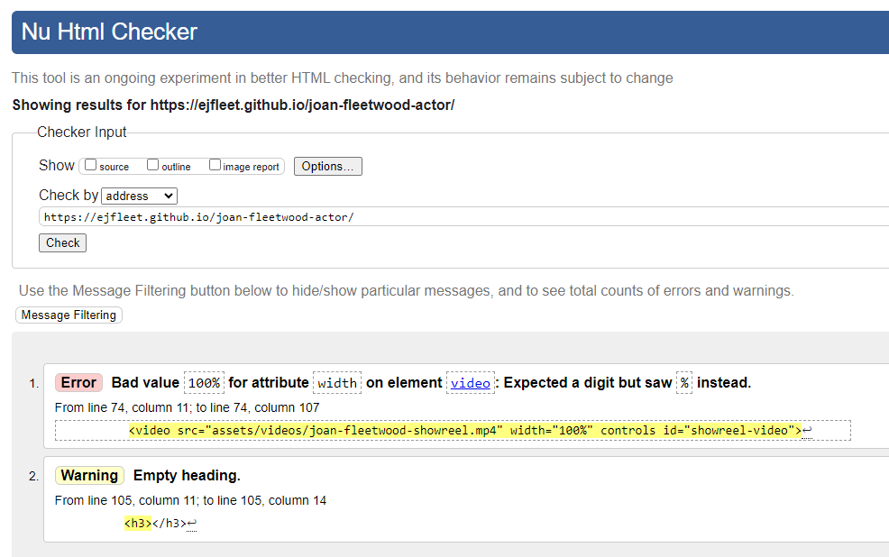

The site now passes the HTML Validation test.

#### CSS

The site initially failed the validation as there was one issue - this was easily fixed by changing padding-top to padding in one of the elements. 

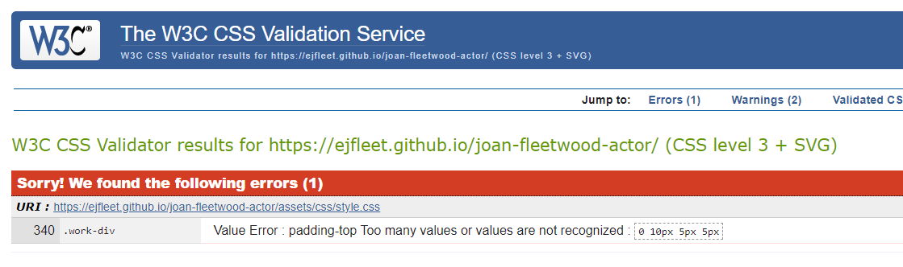

The site now passes the CSS Validation test.

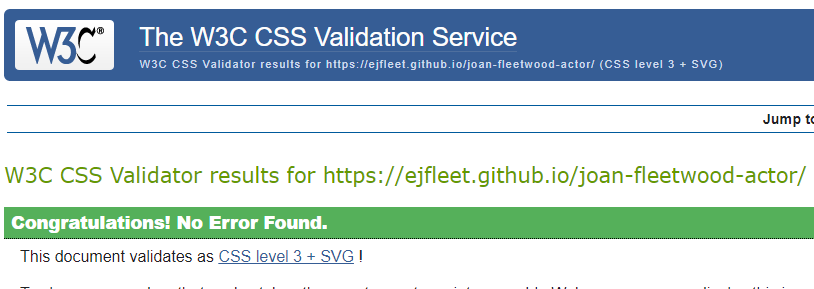

### Lighthouse

I used the Chrome extension Lighthouse to test the site, particularly for Performance and Accessibility.  Results below.

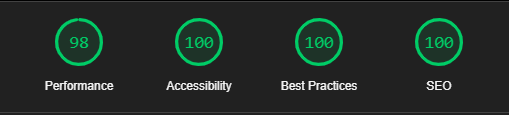

### Solved Bugs

* The original colour scheme for the site used a lighter pink than the current one.  When I tested it on the [achecks.org](https://www.achecks.org/apca-wcag-3-accessible-colour-contrast-checker/) accessibility tester, this colour caused the site to fail as it did not provide enough contrast on the smaller headings or on the 'submit' button against the grey background.  I used [Deque Univerity;s site](https://dequeuniversity.com/rules/axe/4.8/color-contrast) to find a different shade of the pink colour that would meet accessibility standards.  I also changed the font-weight of the headers to make them easier to read.  These measures solved the issue.

* I had difficulty moving the hamburger menu item into the position it has now.  I tried to use every combination of padding and margin to achieve this but I was unsuccessful.  My mentor Brian Macharia instructed me in changing the background colour of the divs to red to be able to see what was happening.  It turned out that I had set the {align-items} value to baseline rather than center, which was the source of all the issues.  The hamburger menu icon is now where I want it to be.

* I initially used   elements for spacing in the index.html, which was pointed out by my mentor as it would mean failing the W3C validation on testing.  I removed these and used CSS to achieve the desired result instead.

## Credits

### Code Used

[Kera Cudmore README](https://github.com/kera-cudmore/Bully-Book-Club/tree/main) for examples of what to include in the README sections.

Code Institute 'Love Running' walkthrough project for the hamburger navigation menu, the gallery and the footer.

Code Institute's sample README for ideas of what to put in each section.
 
[Stack Overflow](https://stackoverflow.com/questions/11501025/div-anchors-scrolling-too-far) and [CSS-Tricks](https://css-tricks.com/hash-tag-links-padding/) for the code to add top margin to the section elements following a scroll event, to compensate for the fixed header.

[W3C Schools](https://www.w3schools.com/css/css3_variables.asp) for the code to use variables in CSS.

[Tapas Adhikary](https://github.com/atapas/markdown-cheatsheet) for his markdown cheatsheet.

Traversy Media for their [Flexbox Crash Course](https://youtu.be/3YW65K6LcIA?si=muQloPSlDEk8zo3J) video.

### Content

Content for the website was provided by Joan Fleetwood.  The About Me paragraph was edited by Emma Fleetwood.

### Media

#### Main Image and Gallery Images

All images were provided by Joan Fleetwood.

#### Showreel Video

This video was downloaded from Joan's [Vimeo account](https://vimeo.com/user14640532).

#### Background Image for Contact Form

The image of studio lights on a plain grey background was downloaded from [iStock.com](https://istock.com).
  
### Acknowledgments

* My mentor Brian Macharia for his help and clear explanations of what needed to be done
* Amy Richardson for facilitating our weekly standups and being a font of information and encouragement
* Terry Loughran for his advice on how long the README might take to do!
* Tom Hall on Slack for taking the time to peer review my code
* Ahmed_3P on Slack for peer reviewing my code and making suggestions
* My friends and family for testing the project on their devices and offering words of encouragement